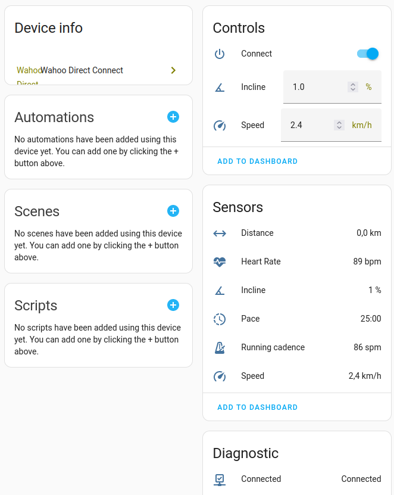
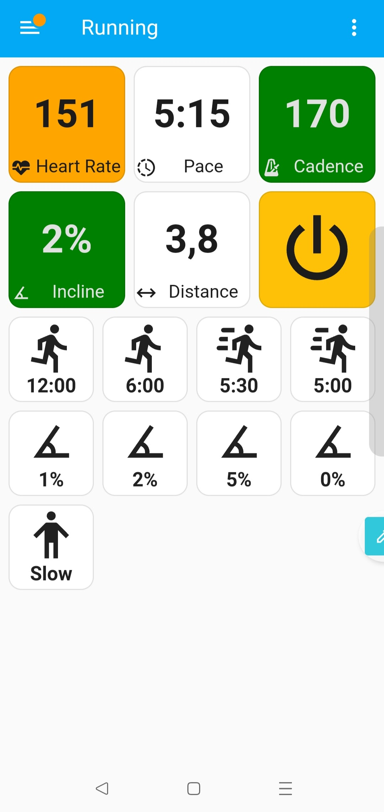

### Wahoo Direct Connect integration for Home Assistant

  * Exposes a number of already supported metrics as Sensors
  * Some of parameters (Speed, Inclination) can be controlled

Current development focus (and environment) is treadmill and [QZ (qdomyos-zwift)](https://github.com/cagnulein/qdomyos-zwift) support, but can be tested on and extended to real devices and cycling support

#### Installation

* Install this repo via HACS (integration)

#### Screenshots

Device entities

Sample Lovelace dashboard

